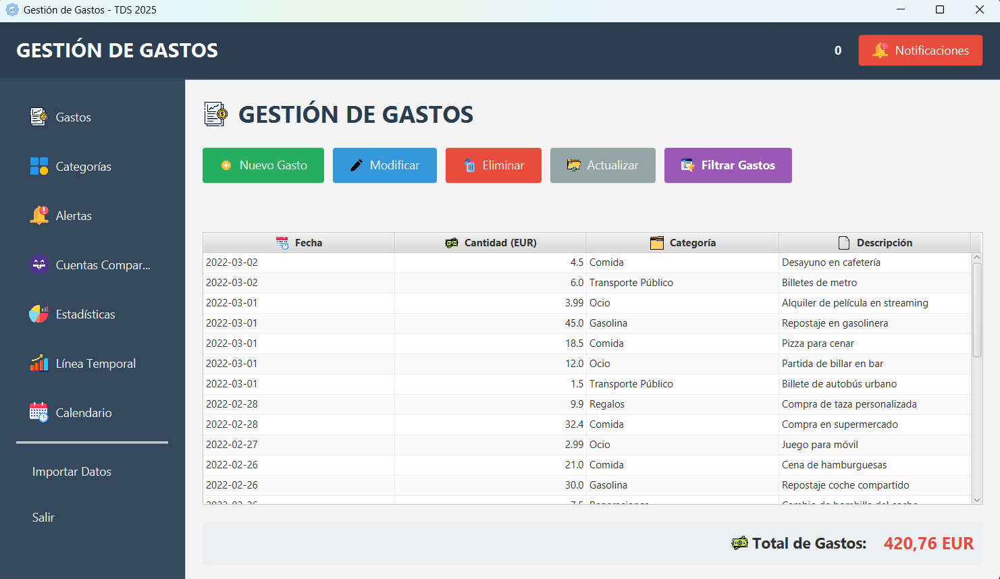
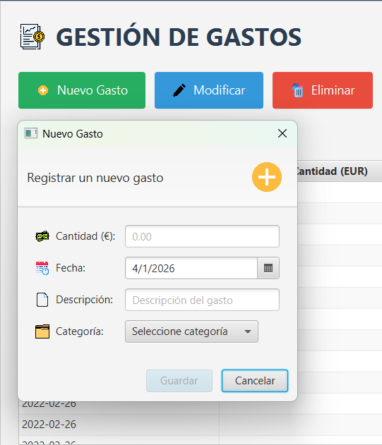
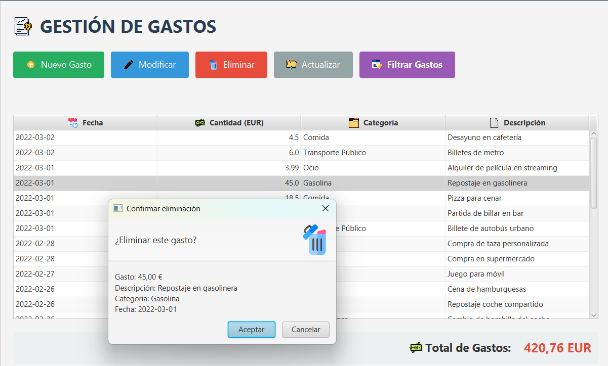
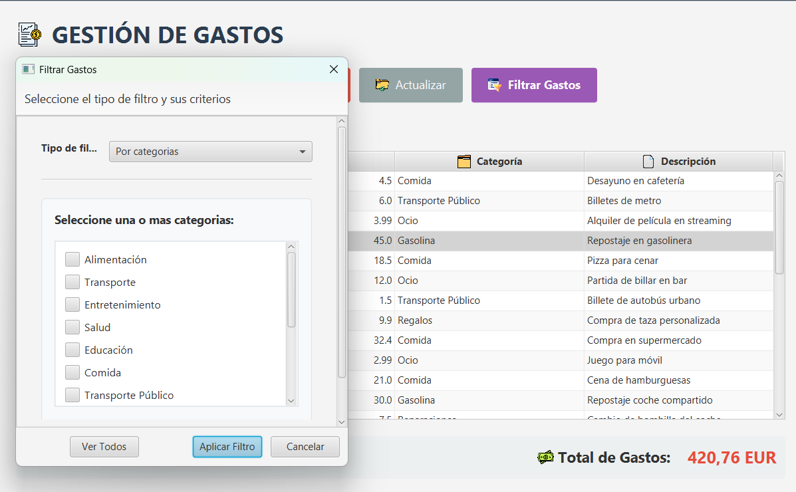
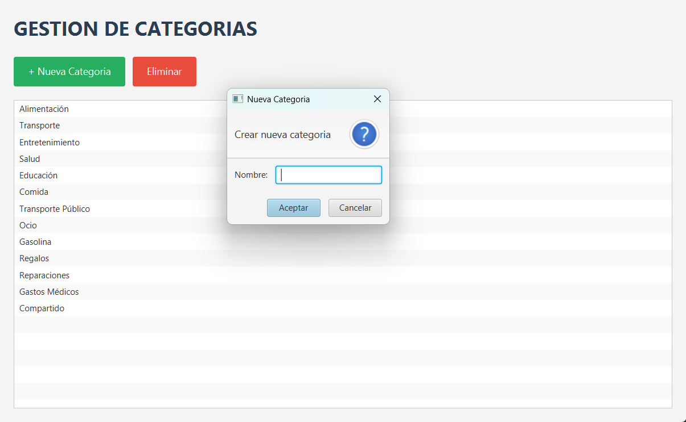
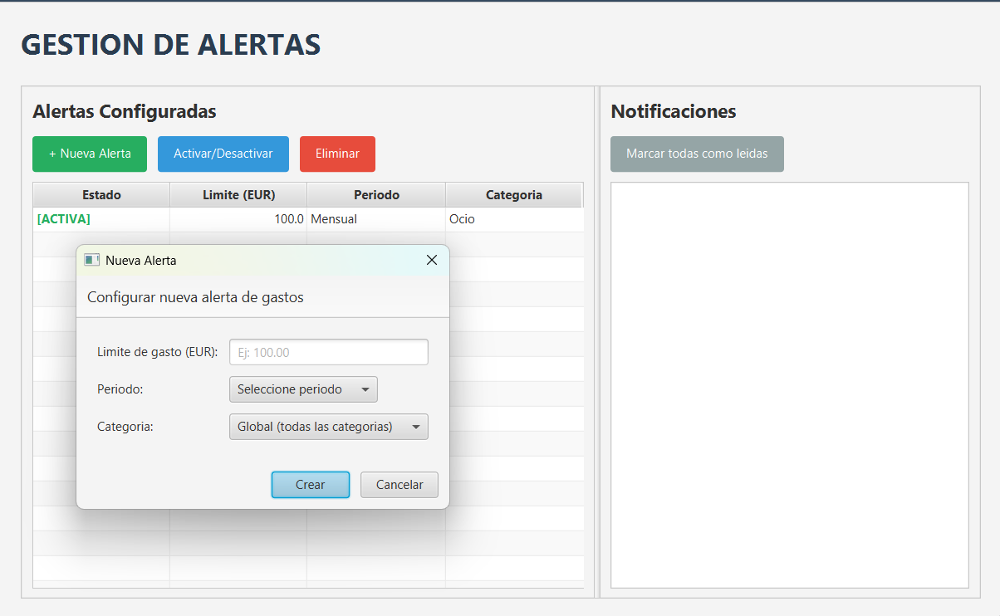
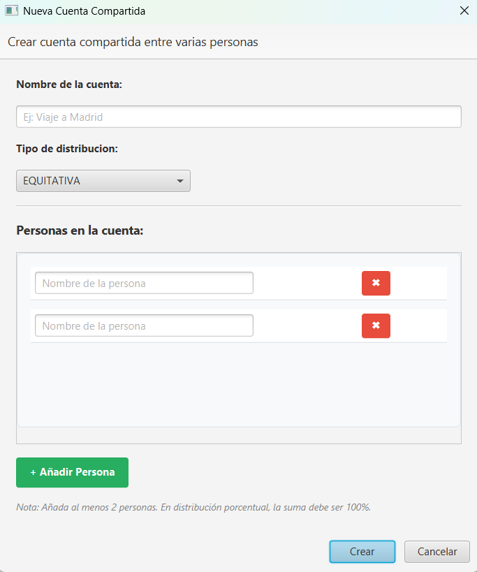
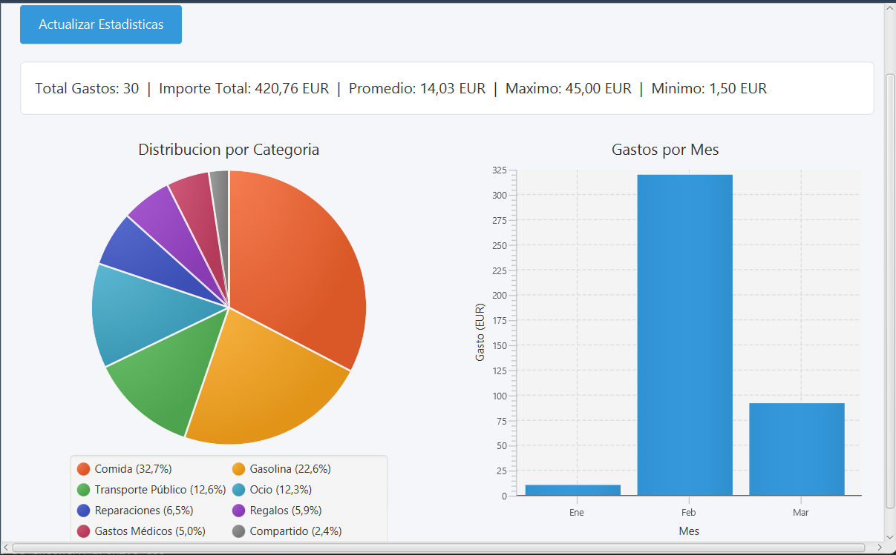

# Manual de Usuario: Sistema de Gestión de Gastos

**Versión del documento:** 1.0  
**Fecha:** Enero 2026

---

## 1. Introducción

Este manual describe el funcionamiento de la aplicación de **Gestión de Gastos**, una herramienta diseñada para controlar las finanzas personales, gestionar presupuestos mediante alertas y administrar cuentas compartidas entre grupos de personas.

La aplicación ofrece dos modos de interacción:

1. **Interfaz Gráfica (GUI):** Ventanas, gráficos y ratón (Modo predeterminado).
2. **Interfaz de Línea de Comandos (CLI):** Menú textual para operaciones rápidas en terminal.

---

## 2. Requisitos e Instalación

Para ejecutar este proyecto, es necesario tener instalado en el equipo:

- **Java JDK 17** o superior.
- **Maven** (para la gestión de dependencias).
- (Opcional) **Eclipse IDE** si se desea ejecutar desde el entorno de desarrollo.

### 2.1. Descarga del Proyecto

Clone el repositorio o descomprima el archivo `.zip` del proyecto en su directorio de trabajo.

---

## 3. Ejecución de la Aplicación

Existen tres formas principales de iniciar el programa dependiendo de su entorno.

### Opción A: Ejecutar desde Eclipse IDE

1. Abra Eclipse y seleccione `File > Import > Maven > Existing Maven Projects`.
2. Navegue a la carpeta del proyecto y finalice la importación.
3. En el "Package Explorer", busque la clase principal: `src/main/java/ui/Main.java`.
4. Haga clic derecho sobre `Main.java` y seleccione **Run As > Java Application**.
   - _Nota:_ Esto lanzará la interfaz gráfica por defecto.

### Opción B: Ejecutar mediante Maven (Terminal)

Si no utiliza Eclipse, puede ejecutar la aplicación directamente desde la consola usando Maven.

**Para la Interfaz Gráfica:**

Se emplean los siguientes comandos:

    mvn clean javafx:run

O alternativamente:

    mvn exec:java -Dexec.mainClass="ui.Main"

**Para la Línea de Comandos (CLI):**
El sistema detecta el argumento `--cli` para iniciar en modo texto .

    mvn exec:java -Dexec.mainClass="ui.Main" -Dexec.args="--cli"

### Opción C: Ejecutar archivo JAR empaquetado

Si ha generado el archivo ejecutable (`.jar`) mediante el comando `mvn package`:

1. Navegue a la carpeta `/target` generada.
2. Ejecute el siguiente comando:

**Modo Gráfico:**
java -jar gestion-gastos-1.0.jar

**Modo Consola:**
java -jar gestion-gastos-1.0.jar --cli

---

## 4. Guía de Uso: Interfaz Gráfica (GUI)

Al iniciar la aplicación, verá una barra lateral izquierda con el menú de navegación y un panel central donde se muestra la información.

### 4.1. Gestión de Gastos (Pantalla Principal)

Es la vista por defecto. Aquí puede ver una tabla con todos los gastos registrados.

- **Registrar Nuevo Gasto:**

  1. Pulse el botón **"Nuevo Gasto"** (icono verde).
  2. Introduzca la **Cantidad** (use punto para decimales, ej: `15.50`).
  3. Seleccione la **Fecha** en el calendario (por defecto es hoy).
  4. Escriba una **Descripción** (opcional).
  5. Seleccione una **Categoría** del desplegable.
  6. Pulse **Guardar**.

- **Modificar/Eliminar:**

  - Seleccione un gasto de la tabla y pulse los botones **Modificar** (azul) o **Eliminar** (rojo) situados en la parte superior.
  - _Nota:_ Puede seleccionar múltiples gastos para eliminarlos en bloque.

- **Filtrado Avanzado:**
  - Pulse el botón violeta **"Filtrar Gastos"**.
  - Puede filtrar por: Categorías específicas, Rango de fechas, Meses concretos o una combinación de estos.

### 4.2. Categorías

Acceda desde el menú lateral "Categorías".

- Permite crear etiquetas para organizar sus gastos (ej. "Supermercado", "Coche").
- Use el botón **"+ Nueva Categoría"** e introduzca un nombre único.

### 4.3. Alertas y Presupuestos

El sistema permite configurar límites de gasto para recibir notificaciones automáticas.

1. Vaya a la sección **"Alertas"**.
2. Pulse **"+ Nueva Alerta"**.
3. Configure:
   - **Límite:** Cantidad máxima a gastar (ej. 200€).
   - **Periodo:** Semanal o Mensual.
   - **Categoría:** Puede ser global (todo el gasto) o específica (solo "Ocio").
4. **Funcionamiento:** Si sus gastos superan el límite, el sistema mostrará una notificación emergente (Pop-up) y registrará el aviso en el historial.

### 4.4. Cuentas Compartidas

Ideal para viajes o grupos de amigos.

1. Vaya a **"Cuentas Compartidas"**.
2. Pulse **"+ Nueva Cuenta"**.
3. Defina el nombre y el tipo de reparto:
   - **Equitativa:** Todos pagan lo mismo.
   - **Porcentual:** Defina qué % paga cada uno (debe sumar 100%).
4. Añada a los participantes (Mínimo 2 personas).
5. **Añadir Gasto al Grupo:** Dentro de la cuenta, use "Añadir Gasto" y especifique **quién pagó**.
6. **Ver Deudas:** El sistema calculará automáticamente quién debe dinero a quién (Saldos positivos/negativos).

### 4.5. Visualización y Estadísticas

- **Estadísticas:** Muestra gráficos de "tarta" (distribución por categoría) y de barras (gasto por meses).
- **Línea Temporal:** Vea sus gastos ordenados cronológicamente en una línea de tiempo vertical.
- **Calendario:** Visualización tipo calendario mensual donde cada gasto aparece en su día correspondiente.

### 4.6. Importación de Datos

Puede cargar datos masivos desde ficheros externos (CSV/TXT).

1. Pulse **"Importar Datos"** en el menú lateral.
2. Seleccione el archivo en su ordenador.
3. El sistema procesará las líneas y creará los gastos y categorías automáticamente.

---

## 5. Guía de Uso: Línea de Comandos (CLI)

Si ejecuta la aplicación con el argumento `--cli`, verá el siguiente menú en su terminal :

### Operaciones Comunes en CLI

- **Navegación:** Escriba el número de la opción y pulse `Enter`.
- **Registrar Gasto (Opción 1):**
  - El sistema le pedirá secuencialmente: Cantidad, Fecha (formato `dd/MM/yyyy` o Enter para hoy), Descripción y le mostrará una lista numerada para elegir la Categoría .
- **Listar Gastos (Opción 2):** Muestra una tabla formateada en texto con el ID, fecha, importe y descripción de cada gasto, además del total acumulado .
- **Ver Estadísticas (Opción 7):** Muestra el número total de gastos, el importe total sumado y el gasto promedio por movimiento.
- **Abrir GUI (Opción 8):** Permite lanzar la ventana gráfica desde la consola sin detener el programa [cite: 692-693].

---

## 6. Solución de Problemas

- **Error: "La suma de porcentajes debe ser 100%"**

  - _Causa:_ Al crear una cuenta compartida porcentual, los valores introducidos no suman exactamente 100.
  - _Solución:_ Revise los decimales asignados a cada participante .

- **El archivo CSV no se importa**

  - _Causa:_ El formato del archivo no coincide con el esperado por el `AdaptadorBancario`.
  - _Solución:_ Asegúrese de que el CSV tiene al menos 8 columnas separadas por comas, incluyendo fecha, categoría y cantidad.

- **No veo las notificaciones**
  - _Causa:_ Las alertas solo saltan si el gasto _excede_ el límite configurado.
  - _Solución:_ Compruebe que la alerta está marcada como "ACTIVA" en el panel de alertas.
